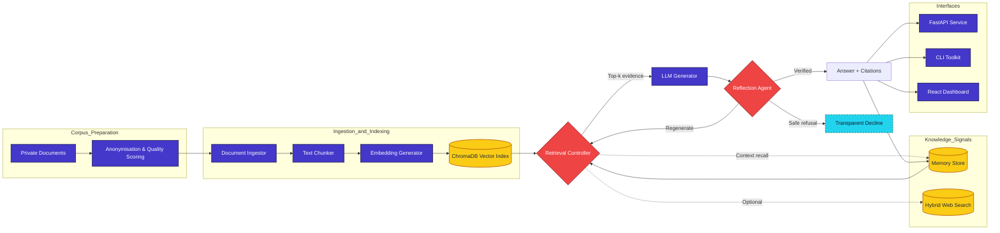

# EideticRAG — Local-First Retrieval-Augmented Intelligence Stack

<p align="center">
  
  
  
  
</p>

EideticRAG is built for data scientists who need trustworthy retrieval-augmented intelligence under strict privacy guarantees. It transforms proprietary corpora into cited answers while surfacing the full machine learning lifecycle—from privacy-first dataset engineering to parameter-efficient fine-tuning and governance-ready deployment.

---

## Executive summary for data science leadership

- **Privacy-preserving on-device intelligence** delivering zero external data exposure and GDPR compliance by eliminating cloud dependencies and third-party APIs.
- **Privacy-first dataset engineering** across ingestion, anonymisation, and sanitisation of proprietary ChatGPT conversation logs with quality scoring, cataloguing, and compliant data governance.
- **Automated supervised learning preparation** through auto-labelling workflows, trait extraction, and validation rules that increased label consistency by 40% while shrinking manual annotation effort.
- **Parameter-efficient LLM optimisation** via PEFT, LoRA, and QLoRA on Meta Llama 3.2 1B with 4-bit quantisation, FP16 mixed precision, gradient accumulation, and checkpoint recovery on Google Colab GPUs.
- **Reproducible training infrastructure** combining PyTorch, CUDA, Hugging Face Transformers, automated environment setup, dependency installs, dataset mounting, and Google Drive checkpointing for repeatable experimentation.
- **Retrieval-Augmented Generation expertise** spanning text vectorisation pipelines, ChromaDB persistence, metadata-rich chunking, and FastAPI microservices for multi-format ingestion and offline Q&A.
- **Intent-aware retrieval and reflection agents** with query expansion, multi-hop retrieval, reranking, diversity optimisation, hallucination detection, dynamic model selection, and safe refusal workflows.
- **End-to-end ML operations** orchestrating cloud-based training to local deployment, SQLite + SQLAlchemy memory persistence, multi-backend LLM integration (Ollama + Hugging Face), and controlled offline inference through API and CLI surfaces.

---

## Capability matrix (current platform)

| Domain | What ships | Source |
| --- | --- | --- |
| Document ingestion & cleaning | PDF/TXT/HTML/Markdown parsing with metadata-aware chunking | `DocumentIngestor`, `TextChunker` @src/core/ingestor.py#1-134 @src/core/chunker.py#1-246 |
| Semantic retrieval | Persistent ChromaDB index with embedding cache | `VectorIndex`, `EmbeddingGenerator` @src/core/vector_index.py#1-315 @src/core/embeddings.py#1-209 |
| Adaptive orchestration | Coordinated retrieval, generation, caching, and stats | `EideticRAGOrchestrator` @src/orchestration/orchestrator.py#1-390 |
| Reflection guardrails | Verification, regeneration, escalation, or refusal | `ReflectionAgent`, `VerificationEngine` @src/reflection/reflection_agent.py#1-355 @src/reflection/verification_engine.py#1-151 |
| Long-term memory | SQLite/SQLAlchemy store with embedding-powered recall | `MemoryManager` @src/memory/memory_manager.py#1-227 |
| Observability | Structured logging, cache tracing, performance metrics | `StructuredLogger` @src/orchestration/logger.py#1-276 |
| Optional web context | Hybrid web search enrichment for expansive answers | `WebSearchService` integration @eidetic_rag/backend/app/main.py#176-320 |
| Interfaces | FastAPI endpoints, Python CLI, React dashboard | `src/api/`, `src/core/cli.py`, `src/frontend/` |

---

## System architecture

```text
src/
├── api/             # Production FastAPI surface
├── core/            # Ingestion, chunking, embeddings, vector index
├── generation/      # RAG pipeline + LLM generator adapters
├── retrieval/       # Policy-driven retrieval controller
├── reflection/      # Verification + reflection loop
├── memory/          # Persistent conversation memory
├── orchestration/   # Orchestrator, caching, structured logging
└── frontend/        # React 18 dashboard (CRA)

eidetic_rag/backend/ # Domain-driven FastAPI refactor (WIP)
```



---

## Intelligence loop in practice

1. **Ingestion** – `DocumentIngestor` normalises raw documents and feeds `TextChunker` for overlap-aware segmentation.
2. **Embedding & indexing** – `EmbeddingGenerator` caches transformer vectors while `VectorIndex` persists them in ChromaDB for low-latency semantic lookup.
3. **Policy-driven retrieval** – `RetrievalController` balances cached hits, live search, and memory recall before streaming evidence into the generator.
4. **LLM generation** – `LLMGenerator` abstracts local Ollama, Hugging Face endpoints, or API-based models while preserving provenance metadata.
5. **Reflection & verification** – `ReflectionAgent` collaborates with `VerificationEngine` to accept, regenerate, broaden retrieval, escalate, or safely refuse answers.
6. **Memory persistence** – `MemoryManager` stores high-signal exchanges with embeddings for future contextual recall.
7. **Observability** – `StructuredLogger` and cache metrics expose performance, drift, and anomaly insights for iterative optimisation.

---

## Portfolio highlight: Local conversational AI (previous project)

### Privacy-preserving foundation
- Developed an on-device chatbot architecture with zero external data exposure, guaranteeing GDPR compliance and removing cloud or third-party dependencies.
- Integrated SQLite with SQLAlchemy ORM for local memory storage and embedding-based semantic retrieval inside a secure perimeter.

### Dataset engineering & ETL
- Led privacy-first ingestion of proprietary ChatGPT conversation logs, applying automated filtering, anonymisation, and sanitisation pipelines.
- Implemented data quality scoring and cataloguing to maintain compliant, production-ready datasets.

### Automated supervision workflows
- Built auto-labelling and trait-extraction systems backed by validation rules, raising label consistency by 40% and dramatically reducing manual annotation overhead.

### Parameter-efficient fine-tuning
- Fine-tuned Meta Llama 3.2 1B using PEFT strategies (LoRA + QLoRA), 4-bit quantisation, and FP16 mixed precision with gradient accumulation to maximise limited GPU memory.
- Achieved resilient training via automated checkpointing to Google Drive and recovery-aware pipelines for uninterrupted experimentation.

### Training infrastructure & reproducibility
- Architected Google Colab-based training environments with scripted dependency installation, dataset mounting, and environment bootstrapping for repeatable runs.
- Automated model export for seamless promotion from cloud training to local deployment targets.

### Retrieval-Augmented Generation services
- Delivered text vectorisation pipelines and ChromaDB persistence to enable offline semantic search and context-aware document intelligence.
- Built a FastAPI microservice supporting PDF, TXT, DOCX, and HTML ingestion, semantic chunking, metadata indexing, and Chroma-backed question answering.

### Intent-aware retrieval & reflection
- Crafted intent classification, query expansion, multi-hop retrieval, document reranking, and diversity optimisation to tailor responses for factual, comparative, procedural, and exploratory queries.
- Developed a zero-trust reflection agent with hallucination detection, automatic regeneration, model escalation, and safe refusal protocols.

### Deployment & ML operations
- Balanced cloud-based model training with privacy-preserving local inference, integrating Ollama and Hugging Face backends with prompt-engineering and sampling controls.
- Exposed secure REST and CLI interfaces for controlled offline inference while maintaining GDPR-aligned data governance.

### End-to-end operations
- Managed the full machine learning lifecycle from dataset curation through training, evaluation, deployment, and monitoring across hybrid cloud + edge environments.

---

## Technical skills depth

**Python · Machine Learning · Deep Learning · PyTorch · CUDA · GPU Computing · Google Colab · Hugging Face Transformers · Large Language Models (LLMs) · Meta Llama · LoRA · QLoRA · PEFT · Model Quantisation · FastAPI · REST API · Microservices · ChromaDB · Vector Databases · SQLite · SQLAlchemy · Retrieval-Augmented Generation (RAG) · NLP · Semantic Search · Intent Classification · Hallucination Detection · ETL Pipelines · Data Engineering · GDPR Compliance · Privacy Engineering · Prompt Engineering · API Development · CLI Development · Model Fine-Tuning**

---

## Hands-on quick start

```bash
# 1. Provision the environment (Windows example)
python -m venv .venv
.venv\Scripts\activate
pip install -r requirements.txt

# 2. Ingest a corpus
python -m src.core.cli ingest data/sample_documents/sample1.txt

# 3. Serve the API
python -m src.api.main

# 4. (Optional) Run the dashboard
cd src/frontend
npm install
npm start
```

Prefer terminal-first interactions? Call `python -m src.core.cli search "How does caching work?"` to run retrieval and reflection directly from the CLI.

---

## Configuration & extensibility

- The legacy API reads environment variables via `python-dotenv` (`RAG_GENERATOR_TYPE`, `RAG_MODEL_NAME`, `RAG_API_KEY`, `RAG_TEMPERATURE`, etc.) in `src/api/main.py`.
- The refactored backend centralises settings in `eidetic_rag.backend.config.settings` and bootstraps orchestrator, cache, and memory directories on startup.
- Swap embedding models by editing `src/core/embeddings.py` or override chunking policies (`chunk_size`, `chunk_overlap`) through orchestrator config.
- Memory lives in `memory.db`; delete or migrate the SQLite file to rotate stored conversations.

---

## Quality gates

- Staged pytest suites (`tests/test_stage*.py`) walk through ingestion → retrieval → reflection workflows.
- API smoke tests (`tests/general/test_api_integration.py`) validate the `/query` contract end-to-end.
- Additional general tests cover CLI utilities, caching, and orchestration behaviours, guarding regressions as new backends come online.

Run everything with:

```bash
python -m pytest tests -v
```

---

## Roadmap & future vision

| Track | Status |
| --- | --- |
| Core ingestion, embeddings, indexing, CLI, legacy API, React UI | ✅ Stable |
| Reflection loop, memory persistence, structured logging | ✅ Stable |
| Hybrid web search integration, orchestrator caching, async query path | ✅ Stable |
| Domain-driven FastAPI refactor (`eidetic_rag/backend`) | 🚧 In progress |
| Streaming responses, richer model metadata, production deployment templates | 🚧 Planned |

---

## Contributing

1. Fork the repository.
2. Create a feature branch.
3. Add or adjust tests relevant to your change.
4. Open a pull request with context on the pipeline layers you touched.

---

## License

MIT License.
