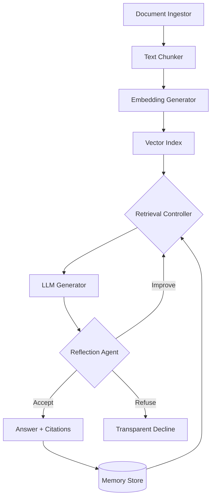

# EideticRAG — Local-First Retrieval-Augmented Intelligence Stack

EideticRAG turns private document collections into trustworthy, cited answers without sending data off the workstation. The stack blends ingestion, semantic retrieval, large language model generation, reflection, and long-term memory into a cohesive developer experience.

---

## Why builders reach for EideticRAG

1. **Local-first by design** – Every critical component runs on your hardware; bring your own models, vectors, and storage.
2. **Defensive generation** – Reflection and verification loops reduce hallucinations before a response ever leaves the API.
3. **Production guardrails** – Structured logging, caching, memory persistence, and staged tests ship in the box.
4. **Multiple surfaces** – FastAPI service, CLI tooling, and a React dashboard cover automation, scripting, and product demos.

---

## Capability snapshot

| Domain | What ships | Source |
| --- | --- | --- |
| Document ingestion & cleaning | PDF/TXT/HTML/Markdown parsing with metadata-aware chunking | `DocumentIngestor`, `TextChunker` @src/core/ingestor.py#1-134 @src/core/chunker.py#1-246 |
| Semantic retrieval | Persistent ChromaDB index with embedding cache | `VectorIndex`, `EmbeddingGenerator` @src/core/vector_index.py#1-315 @src/core/embeddings.py#1-209 |
| Adaptive orchestration | Coordinated retrieval, generation, caching, and stats | `EideticRAGOrchestrator` @src/orchestration/orchestrator.py#1-390 |
| Reflection guardrails | Answer verification, regeneration, escalation, or refusal | `ReflectionAgent`, `VerificationEngine` @src/reflection/reflection_agent.py#1-355 @src/reflection/verification_engine.py#1-151 |
| Long-term memory | SQLite/SQLAlchemy store with embedding-powered recall | `MemoryManager` @src/memory/memory_manager.py#1-227 |
| Observability | Loguru-based structured logs, cache tracing, performance metrics | `StructuredLogger` @src/orchestration/logger.py#1-276 |
| Optional web context | Async hybrid web search ingestion for expansive answers | `WebSearchService` integration @eidetic_rag/backend/app/main.py#176-320 |
| Interfaces | FastAPI endpoints, Python CLI, and React dashboard | `src/api/`, `src/core/cli.py`, `src/frontend/` |

---

## Architecture at a glance

```text
src/
├── api/             # Production FastAPI surface
├── core/            # Ingestion, chunking, embeddings, vector index
├── generation/      # RAG pipeline + LLM generator adapters
├── retrieval/       # Policy-driven retrieval controller
├── reflection/      # Verification + reflection loop
├── memory/          # Persistent conversation memory
├── orchestration/   # Orchestrator, caching, structured logging
└── frontend/        # React 18 dashboard (CRA)

eidetic_rag/backend/ # Domain-driven FastAPI refactor (WIP)
```



---

## How the intelligence loop behaves

1. **Ingestion** – `DocumentIngestor` normalises raw documents and hands rich metadata to `TextChunker` for overlap-aware segmentation.
2. **Embedding & indexing** – `EmbeddingGenerator` caches sentence-transformer vectors while `VectorIndex` maintains ChromaDB persistence for lightning-fast semantic lookups.
3. **Retrieval orchestration** – `RetrievalController` weighs cached hits, live search, and memory recall before streaming chunks into the pipeline.
4. **Generation** – `LLMGenerator` abstracts local Ollama, Hugging Face endpoints, or API-based models while preserving provenance metadata.
5. **Reflection** – `ReflectionAgent` runs verification cycles via `VerificationEngine`, deciding to accept, regenerate, broaden retrieval, escalate, or refuse responses.
6. **Memory persistence** – `MemoryManager` stores successful exchanges with embeddings so future queries inherit relevant context.
7. **Observability** – `StructuredLogger` captures every stage with JSON logs, cache hit tracing, and performance timings for post-hoc analysis.

---

## Operational surfaces

### FastAPI services

- **Primary service** (`python -m src.api.main`)
  - Endpoints: `/query`, `/ingest`, `/stats`, `/model/info`, `/index/clear`
  - Async orchestration keeps the request thread lightweight thanks to the executor-backed `process_query_async` pipeline.
- **Refactor-in-progress** (`uvicorn eidetic_rag.backend.app.main:app --reload`)
  - Modular dependency injection, optional hybrid web search, and generator hot-swaps for experimentation.

### CLI tooling

`python -m src.core.cli` exposes ingestion, reindex, inspect, and search commands—ideal for scripting or quick regression checks without booting the API.

### Frontend dashboard

React 18 + TypeScript UI lives in `src/frontend/`. During development it proxies to the FastAPI backend, showing ingestion status, query trails, and provenance evidence for demos.

---

## Local-first workflow

```bash
# 1. Provision the environment (Windows example)
python -m venv .venv
.venv\Scripts\activate
pip install -r requirements.txt

# 2. Ingest a corpus
python -m src.core.cli ingest data/sample_documents/sample1.txt

# 3. Serve the API
python -m src.api.main

# 4. (Optional) Run the dashboard
cd src/frontend
npm install
npm start
```

Prefer terminal-first interactions? Call `python -m src.core.cli search "How does caching work?"` to run retrieval and reflection directly from the CLI.

---

## Configuration & extensibility

- The legacy API reads environment variables via `python-dotenv` (`RAG_GENERATOR_TYPE`, `RAG_MODEL_NAME`, `RAG_API_KEY`, `RAG_TEMPERATURE`, etc.) in `src/api/main.py`.
- The refactored backend centralises settings in `eidetic_rag.backend.config.settings` and bootstraps orchestrator, cache, and memory directories on startup.
- Swap embedding models by editing `src/core/embeddings.py` or override chunking policies (`chunk_size`, `chunk_overlap`) through orchestrator config.
- Memory lives in `memory.db`; delete or migrate the SQLite file to rotate stored conversations.

---

## Quality gates

- Staged pytest suites (`tests/test_stage*.py`) walk through ingestion → retrieval → reflection workflows.
- API smoke tests (`tests/general/test_api_integration.py`) validate the `/query` contract end-to-end.
- Additional general tests cover CLI utilities, caching, and orchestration behaviours, guarding regressions as new backends come online.

Run everything with:

```bash
python -m pytest tests -v
```

---

## Roadmap & status

| Track | Status |
| --- | --- |
| Core ingestion, embeddings, indexing, CLI, legacy API, React UI | ✅ Stable |
| Reflection loop, memory persistence, structured logging | ✅ Stable |
| Hybrid web search integration, orchestrator caching, async query path | ✅ Stable |
| Domain-driven FastAPI refactor (`eidetic_rag/backend`) | 🚧 In progress |
| Streaming responses, richer model metadata, production deployment templates | 🚧 Planned |

---

## Contributing

1. Fork the repository.
2. Create a feature branch.
3. Add or adjust tests relevant to your change.
4. Open a pull request with context on the pipeline layers you touched.

---

## License

MIT License.
